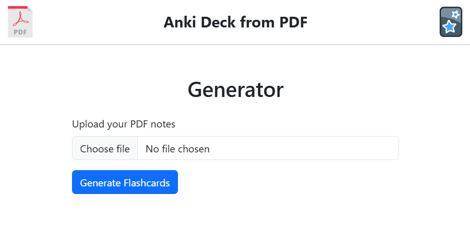

# Anki Deck Generator from PDF

#### Video Demo:  [Youtube](https://youtu.be/evfhG7unHMM)

#### Description:
 

This project is a Flask-based web application that allows you to upload a PDF file (e.g., lecture notes, study guides, etc..) and automatically generate a set of flashcards in an Anki-compatible `.apkg` deck format. By leveraging a large language model (openAI API) for text analysis and card generation, this tool aims to streamline your study process: simply upload your notes as a PDF, and the app will produce flashcards you can instantly import into Anki, making your study sessions more effective and efficient.

**how it works:**
- **Upload PDF Notes:** The simple web interface allows users to upload a PDF document.
- **Text Extraction & Cleaning:** The app extracts text from the uploaded PDF and remove noise, excessive whitespace, and artifacts like page headers and footers.
- **Language Model Integration:** Using a prompt from `prompt.txt` and an API key from `apikey.txt`, the application calls a language model (OpenAI’s API) to transform the cleaned text into a set of flashcards in JSON format.
- **Anki Deck Creation:** The JSON-formatted flashcards are converted into an Anki deck file (`.apkg`), ready for you to download and import into your Anki desktop or mobile application.

## Project Structure

The project’s directory layout is as follows:

```
project_folder/
├─ static/
│  ├─ pdf-logo.svg
│  ├─ anki-logo.svg
│
├─ templates/
│  └─ index.html
│
├─ app.py
├─ helpers.py
├─ prompt.txt
├─ apikey.txt
├─ requirements.txt
└─ README.md
```

### File & Folder Details

1. **`static/` folder:**  
   This directory contains `pdf-logo.svg` and `anki-logo.svg`, used in the header of the web interface.

2. **`templates/` folder:**  
   Contains the HTML templates for the index page, which includes:
   - A header section displaying the PDF and Anki logos.
   - A simple form to upload a PDF file.
   
   Flask’s `render_template` function uses this file to return the main page to the user.

3. **`app.py`:**  
   This is the main Flask application file. It:
   - Initializes the Flask app.
   - Handles the `/` route (the main page), which allows the user to upload a PDF.
   - On form submission (POST request), it processes the PDF file, generates flashcards, and returns an `.apkg` file for download.
   
   Key points in `app.py`:
   - Checks if the uploaded file is indeed a PDF by verifying the file extension.
   - Calls functions from `helpers.py` to extract text, clean it, and run flashcard generation and deck creation.
   - Uses `return send_file(...)` to provide the generated Anki deck file as a downloadable response.

4. **`helpers.py`:**  
   This file encapsulates the core logic behind text extraction, transformation, and deck generation. It includes functions to:
   - **`extract_text_from_pdf(pdf_path)`:** Uses `pdfplumber` to open and extract text from each page of the uploaded PDF.
   - **`clean_extracted_text(text)`:** Cleans the extracted text by removing extra spaces, page numbers, and other non-useful artifacts.
   - **`read_file(filename)`:** A utility function to read content from a file (used to read prompts and API keys).
   - **`run_flashcard_generation(cleaned_text)`:** Uses the OpenAI API to send the cleaned text along with a system prompt and gets back JSON-formatted flashcards.
   - **`run_deck_creation(json_file, deck_name)`:** Takes the generated flashcards (in JSON) and creates an Anki deck file using `genanki`. This involves:
     - Defining a model (template) for the cards.
     - Creating an Anki deck object and adding notes for each flashcard.
     - Writing the deck out as a `.apkg` file.

   Dependencies:
   - `pdfplumber` for PDF text extraction.
   - `openai` for calling the language model API.
   - `genanki` to create the Anki deck.
   - `re` for regular expressions to clean text.
   
   The `run_flashcard_generation` function expects the language model to return JSON containing flashcards. For example, the JSON might look like this:
   ```json
   [
       {"front": "Question?", "back": "Answer"},
       {"front": "What are the labs results in Pericarditis/Pericardial Tamponade?", "back": "CBC has ↑WBC, ↑ CRP, ↑ ESR, ↑ Cr, TSH/T4 shows hypothyroidism sometimes."}
   ]
   ```
   
   These are then turned into Anki notes and compiled into a `.apkg` deck.

5. **`prompt.txt`:**  
   Contains the carefully engineered prompt that instructs the language model how to format its output. By adjusting this prompt, you can influence the style, detail, and complexity of the generated flashcards.

6. **`apikey.txt`:**  
   A text file that stores the secret API key for the language model API.

7. **`index.html`:**  
   An HTML template that provides the user interface. It uses Bootstrap for simple styling and includes:
   - A header with logos.
   - A file upload form where users can submit their PDF.
   - A "Generate Flashcards" button that triggers the server-side logic in `app.py`.

7. **`requirements.txt`:**  
   Lists all the Python dependencies required for running the project (`flask`, `pdfplumber`, `genanki`, `openai`, `requests`,  `re`, `random`, `json`)

   To install dependencies from `requirements.txt`, run:
   ```bash
   pip install -r requirements.txt
   ```

## Running the Project

1. **Set Up Your API Key:**  
   Place your language model API key into the `apikey.txt` file. For example, if using OpenAI:
   ```text
   <-YourSecretAPIKeyHere->
   ```

2. **Prepare Your Prompt:**  
   Edit `prompt.txt` if you want to customize the instructions given to the language model.

3. **Start the Flask Server:**
   ```bash
   flask run
   ```
4. **Upload a PDF and Generate Flashcards:**
   - On the main page, select a PDF file from your computer.
   - Click "Generate Flashcards".

5. **Import into Anki:**
   Open Anki on your computer and import the `.apkg` file. You will see a new deck with the flashcards generated from your PDF notes.

## Customization

- **Modifying the Prompt:**  
  Editing `prompt.txt` allows you to change how the language model interprets and formats the flashcards. For instance, you can ask for multiple-choice questions, definitions only, a specific number of flashcard to generate or more advanced formatting.

- **Changing the Deck Name:**  
  In `app.py` or `helpers.py`, you can alter the `deck_name` used in `run_deck_creation()`. By default, it’s hard-coded to `"Deck_generated"`, but you can dynamically set this name based on user input or file names.

## Troubleshooting

- **No Output or Empty Deck:**  
  If the model returns no flashcards, verify that:
  - The prompt in `prompt.txt` is correct and instructs the model to output JSON.
  - The `apikey.txt` contains a valid API key.
  - The text extraction worked properly (check the console or add print statements).

- **API Key or Rate Limiting Errors:**
  If you encounter authentication errors or rate limit issues, ensure you have a valid key and have not exceeded your rate limits. Double-check the correctness of your API key in `apikey.txt`.

- **JSON Parsing Errors:**
  If the returned JSON from the model cannot be parsed, check:
  - The prompt to ensure the model is instructed clearly to return valid JSON.
  - The raw output by printing the response in `helpers.py`.

- **Token Limit Issues:**
  The total number of tokens used by the prompt, plus the extracted PDF text and the model’s response (including the JSON flashcards), must not exceed the current maximum of **8192 tokens**. Remember that roughly **1 token ≈ 4 characters**.  
  If your prompt and PDF text are very large or produce a lengthy response, you may need to:
  - Simplify or shorten your prompt.
  - Reduce the length of the PDF feeding smaller chunks.
  - Increase the maximum number of tokens per request in `helper.py`.
